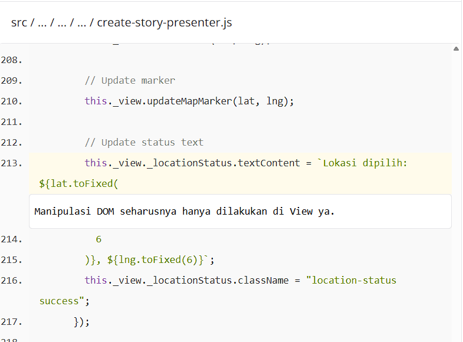
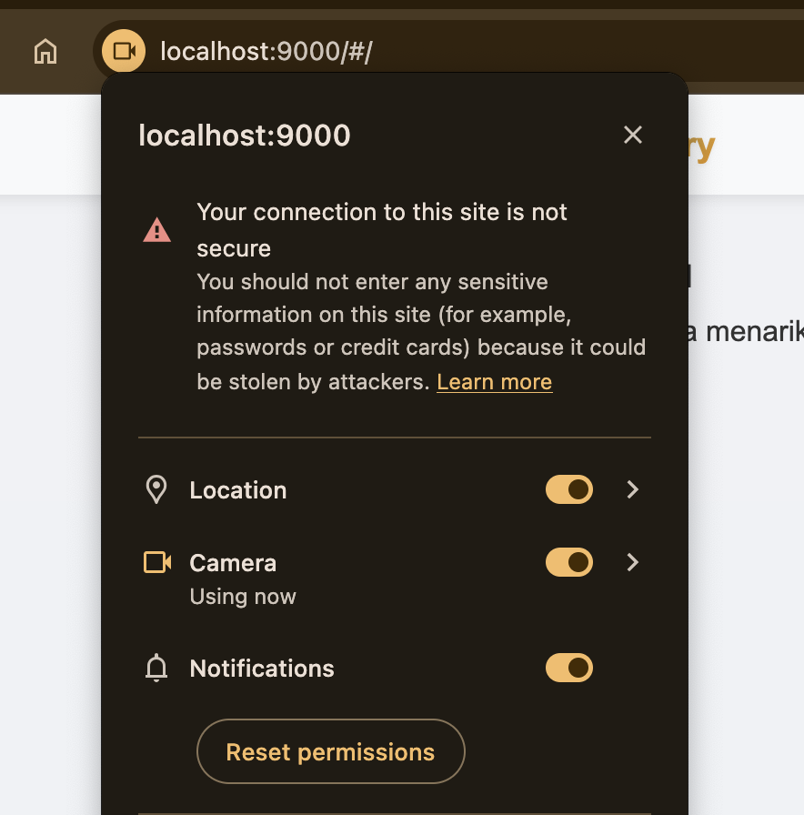
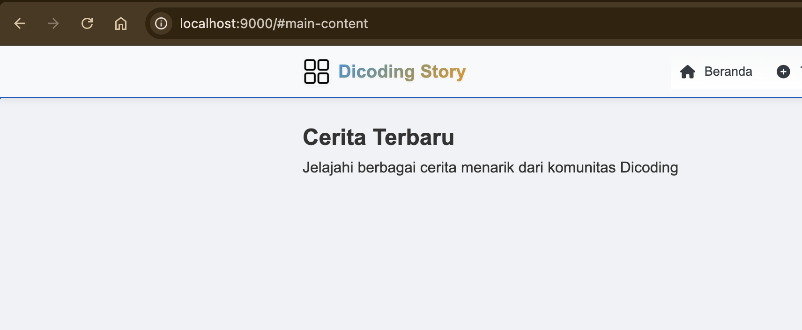

Catatan dari Reviewer

Hai rahmatez_DOMX! Terima kasih telah mengirimkan tugas submission sebagai syarat untuk melanjutkan pembelajaran. Project website yang kamu kirimkan sudah berjalan dengan baik. Namun sayangnya, masih terdapat beberapa catatan yang harus terpenuhi untuk menyelesaikan tugas submission. Yaitu:

Kriteria Wajib 1: Mempertahankan Seluruh Kriteria Wajib Submission Sebelumnya

1.  MVP
    Saat ini penerapan MVP masih belum tepat karena masih ada manipulasi DOM di Presenter.
    Pelajari kembali modul SPA dengan MVP Pattern. terdapat pada D:\laragon\www\Project\Dicoding\Web Intermediate\dicoding-notes-app\src\scripts\mvp\presenters\create-story-presenter.js baris 213 yaitu : // Update status text
    this.\_view.\_locationStatus.textContent = `Lokasi dipilih: ${lat.toFixed(
    Manipulasi DOM seharusnya hanya dilakukan di View ya.

              6
            )}, ${lng.toFixed(6)}`;
            this._view._locationStatus.className = "location-status success";

            Manipulasi DOM seharusnya hanya dilakukan di View ya. 

2.  Stream harus dinonaktif jika tidak digunakan.
    Saat ini aplikasi belum dapat menonaktifkan kamera walaupun pengguna sudah berpindah halaman. Pastikan kamera dinonaktifkan jika pengguna berpindah halaman ya.

3. Aksesibilitas
   Saat ini kamu sudah menerapkan skip to content, namun dalam penerapannya masih kurang tepat, seharusnya skip to content melakukan focusing pada konten utama dari halaman terkait, bukan melakukan perpindahan menuju halaman /#main-content.

 Silakan diperbaiki.

Kriteria Wajib 2: Menerapkan Push Notification

Pastikan web menampilkan alert atau prompt izin (permission) untuk mengaktifkan notifikasi, untuk mempermudah mereka dalam memberikan izin notifikasi jika sebelumnya belum mengizinkannya. Langkah ini penting agar web dapat menampilkan notifikasi dengan lancar setelah pengguna berhasil menambahkan story. Dengan adanya alert tersebut, pengguna akan lebih terbantu dalam memahami bahwa sistem memerlukan izin tambahan untuk memberikan pemberitahuan, sehingga pengalaman penggunaan aplikasi menjadi lebih informatif dan responsif.
Kriteria Wajib 3: Mengadopsi PWA (Installable & Offline)

Penggunaan IndexedDB dalam proyek ini perlu disesuaikan dengan ketentuan yang berlaku, yaitu hanya diperbolehkan untuk mengelola fitur like atau favorite. Penggunaan di luar konteks tersebut, seperti untuk menyimpan data utama atau seluruh proses offline, tidak sesuai dengan kriteria yang ditetapkan. Untuk kebutuhan lainnya, seperti menyimpan data sementara atau mengoptimalkan performa akses data, sebaiknya menggunakan metode caching.
Kamu dapat mengikuti beberapa saran di atas agar submission berikutnya dapat diterima dengan baik.
