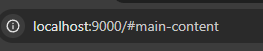

Project website yang kamu kirimkan sudah berjalan dengan baik. Namun sayangnya, masih terdapat beberapa catatan yang harus terpenuhi untuk menyelesaikan tugas submission. Yaitu:

Kriteria Wajib 1
Presenter langsung mengakses properti DOM milik View (\_mapContainer, \_map, \_locationMap, \_locationStatus). Dalam MVP, Presenter tidak seharusnya tahu detail DOM;
terdapat pada : D:\laragon\www\Project\Dicoding\Web Intermediate\dicoding-notes-app\src\scripts\mvp\presenters\create-story-presenter.js

Selain menerapkan pendekatan Single Page Application (SPA), kamu juga perlu menggunakan pola arsitektur Model-View-Presenter (MVP). Dalam pola ini, proyek dibagi menjadi tiga komponen utama:
Model: Bertanggung jawab sepenuhnya atas pengelolaan data dalam aplikasi, seperti: mengambil data dari server melalui HTTP request atau menyimpan data pada sebuah lokasi seperti local storage.
View: Bertanggung jawab sepenuhnya atas tampilan aplikasi yang disajikan ke pengguna. Contoh, kode DOM Manipulation untuk menampilkan loading, menampilkan fallback error, dan menampilkan sebuah data.
Presenter: Merupakan penghubung antara model dan view. Bertanggung jawab untuk mengatur logika presentasi, contoh menggunakan model untuk mendapatkan data dari API kemudian mengirimkan data tersebut ke view melalui sebuah fungsi.
Kamu bisa membaca kembali penerapan pola MVP di modul SPA dengan MVP Pattern.

Skip to Content

Kamu masih belum menerapkan saran dari reviwer sebelumnya dimana masih melakukan perpindahan menuju halaman /#main-content.
Saat ini link skip to content diarahkan ke /#main-content yang membuat browser melakukan navigasi seperti membuka halaman baru, bukan langsung memindahkan fokus ke konten utama di halaman yang sedang dibuka.

Standar aksesibilitas mengharuskan skip link memindahkan fokus keyboard langsung ke elemen konten utama (<main> atau elemen target) tanpa reload atau navigasi ulang halaman.

kamu bisa pastikan elemen target (misalnya <main id="main-content">) bisa menerima fokus sementara dengan tabindex="-1". Gunakan JavaScript untuk memanggil .focus() saat skip link ditekan.

Kamu dapat mengikuti beberapa saran di atas agar submission berikutnya dapat diterima dengan baik.
